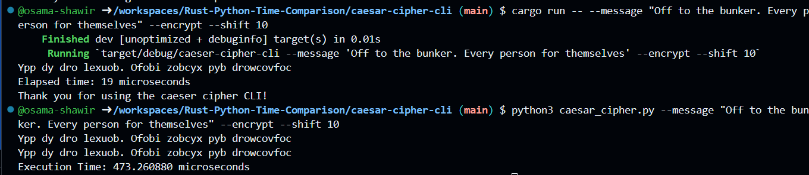

[](https://github.com/osama-shawir/Rust-Python-Time-Comparison/actions/workflows/tests.yml)
[](https://github.com/osama-shawir/Rust-Python-Time-Comparison/actions/workflows/lint.yml)

# Caesar Cipher Performance Comparison

This project aims to compare the performance of implementing the Caesar cipher in Rust and Python. We'll measure the time it takes for each implementation and determine how much faster Rust is compared to Python.

 ## Rust Command-Line Tool

 The Rust implementation of the Caesar cipher is a command-line tool that can be run using the `cargo run` command. The tool accepts the following command-line arguments:

 - `--message "<your_message>"`: The message to be encrypted or decrypted.
 - `--encrypt`: Encrypt the message.
 - `--decrypt`: Decrypt the message.

 For example, to encrypt a message, you would use the following command:

 ```
 cargo run -- --message "Hello, World!" --encrypt
 ```

 ## Data Ingestion/Processing

 The Caesar cipher program ingests data through the command-line arguments. The `--message` argument is used to provide the message to be encrypted or decrypted.

 The program processes the data by applying the Caesar cipher algorithm to the input message. The algorithm shifts each character in the message by a fixed number of positions. The number of positions is determined by the key, which is a secret number known only to the sender and receiver.

 
 ## Unit Tests

 The Caesar cipher program includes unit tests to verify the correctness of the encryption and decryption functions. To run the unit tests, use the following command:

 ```
 cargo test
 ```

 This command runs all the unit tests in the project and displays the results in the terminal. The tests are also ran by default by the pre-defined Github workflows. 

## Performance Metrics

We will calculate and compare the time it takes for both Rust and Python to encrypt or decrypt a message using the Caesar cipher algorithm. The time will be measured in microseconds (μs), allowing us to assess the speed of both implementations with high precision.

## Results

Here are the results of our performance comparison:

- **Rust**: Completed the operation in 19 microseconds.
- **Python**: Completed the operation in 473 microseconds.

## Speedup

To determine how much faster Rust is compared to Python, we can calculate the percentage speedup. This is done by dividing (Python Time)/(Rust Time)

`We arrive at the conclusion that rust is 25 times faster than python for this application`


Rust is approximately 25 times faster than Python in this performance comparison.

## How to Run

To run the performance comparison yourself, follow these steps:

1. Clone this repository or run it on Codespaces.
2. Navigate to the project's Caesar-Cipher_CLI directory.
3. Run the Rust implementation using the following command:

```bash
   cargo run -- --message "<your_message>" --encrypt
```

include any other flags or options that you would like to include and use your preferred message and record the output time that will be printed in the terminal.

Run the Python implementation using the following command:

```bash
python caesar_cipher.py --message "<your_message>" --encrypt
```

Include the same flags and preferences that you used for the rust experiment and compare the time it takes compared to rust.

The figure below demonstrates these operations and their results:



## Conclusion

In this performance comparison, Rust demonstrates its significant performance advantages over Python when implementing the Caesar cipher algorithm. Rust was able to complete the operation in just 19 microseconds, while Python required 473 microseconds for the same task. 

This remarkable performance boost showcases Rust's ability to execute encryption and decryption operations with exceptional speed and efficiency. Such efficiency can be of great value in scenarios where quick processing is essential, such as cryptography and security applications.

The results make a strong case for considering Rust as a favorable language for performance-critical tasks like encryption, where speed can be a critical factor in achieving the desired outcomes.

By choosing Rust, developers can optimize their applications, reducing processing time and enhancing overall performance. The approximately 2500% speed advantage demonstrates the significant impact Rust can have on tasks that involve encryption, making it a compelling choice for performance-driven projects.
